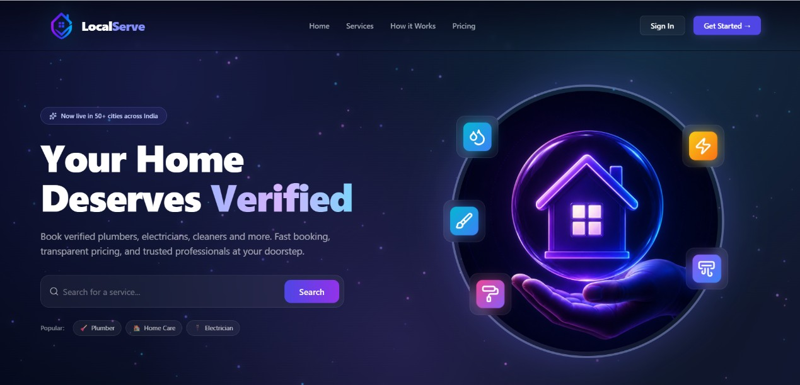

# 🛠️ LocalServe - Local Service Finder & Booking Platform

LocalServe is a full-stack, real-time web application designed to connect users with local service providers (like Plumbers, Electricians, Cleaners, and Beauticians). It simplifies finding, booking, chatting with, and paying service providers.

---

## 📸 Application Screenshot

Below is a preview of the **LocalServe** homepage:



---

## 🚀 Key Features

### 👤 For Users
- **Search & Filter:** Find service providers based on category, rating, location, and price.
- **Easy Booking:** Simple date-and-time booking system for local services.
- **Secure Payments:** Integrated with Razorpay for safe, frictionless online payments.
- **Real-Time Chat:** Message providers instantly to discuss job details before or after booking.
- **Booking Management:** Track booking statuses (Pending, Accepted, Rejected, Completed) and view payment history.

### 💼 For Service Providers
- **Professional Onboarding:** Create a profile specifying services, experience, hourly rates, service location, and availability.
- **Job Management:** Accept, reject, or mark bookings as completed.
- **Provider Dashboard:** Track total earnings, active bookings, completed jobs, and average ratings.
- **Customer Chat:** Directly communicate with customers in real-time.

### 🔑 For Admins
- **Interactive Dashboard:** View analytics on platform performance (Total Users, Registered Providers, Successful Bookings, Total Platform Revenue).
- **User & Provider Verification:** Approve or reject new provider requests to maintain high-quality services.
- **Service Categories:** Add and manage system-wide service categories.
- **Overall Booking Logs:** Track all bookings happening across the platform.

---

## 🛠️ Tech Stack

- **Frontend:** React, Vite, TailwindCSS, Framer Motion (for animations), Lucide Icons, Chart.js (for admin analytics), Socket.io-client.
- **Backend:** Node.js, Express.js, Socket.io (for real-time messaging), Sequelize (ORM).
- **Database:** PostgreSQL.
- **Integrations:** Razorpay (Payments), Nodemailer (Email/OTP verification), Node-cron (Scheduled tasks).

---

## ⚙️ Project Setup & Installation

Follow these steps to run the application locally.

### Prerequisites
- Node.js (v16+)
- PostgreSQL database running locally or in the cloud.

---

### Step 1: Backend Configuration

1. Navigate to the backend directory:
   ```bash
   cd backend
   ```
2. Install dependencies:
   ```bash
   npm install
   ```
3. Create a `.env` file in the `backend` folder and populate it with your environment variables:
   ```env
   PORT=5000
   DB_HOST=localhost
   DB_PORT=5432
   DB_NAME=localservices
   DB_USER=postgres
   DB_PASSWORD=your_postgres_password
   JWT_SECRET=your_jwt_secret_key
   
   # Nodemailer SMTP Config (Gmail Example)
   SMTP_HOST=smtp.gmail.com
   SMTP_PORT=587
   SMTP_USER=your_email@gmail.com
   SMTP_PASS=your_gmail_app_password
   EMAIL_FROM="LocalServe" <your_email@gmail.com>
   
   # Razorpay API Config
   RAZERPAY_KEY_ID=your_razorpay_key_id
   RAZERPAY_KEY_SECRET=your_razorpay_secret
   ```
4. Start the backend server:
   ```bash
   npm run dev
   ```
   *The server runs by default on `http://localhost:5000`.*

---

### Step 2: Frontend Configuration

1. Navigate to the frontend directory:
   ```bash
   cd ../frontend-vite
   ```
2. Install dependencies:
   ```bash
   npm install
   ```
3. Create a `.env` file in the `frontend-vite` folder:
   ```env
   VITE_API_URL=http://localhost:5000
   VITE_RAZORPAY_KEY_ID=your_razorpay_key_id
   ```
4. Start the development server:
   ```bash
   npm run dev
   ```
   *The client app runs by default on `http://localhost:5173`.*

---

## 📱 Mobile Testing Setup
If you want to test the app on a mobile device on the same local network, please check the [MOBILE_TESTING_SETUP.md](./MOBILE_TESTING_SETUP.md) file for step-by-step setup instructions.